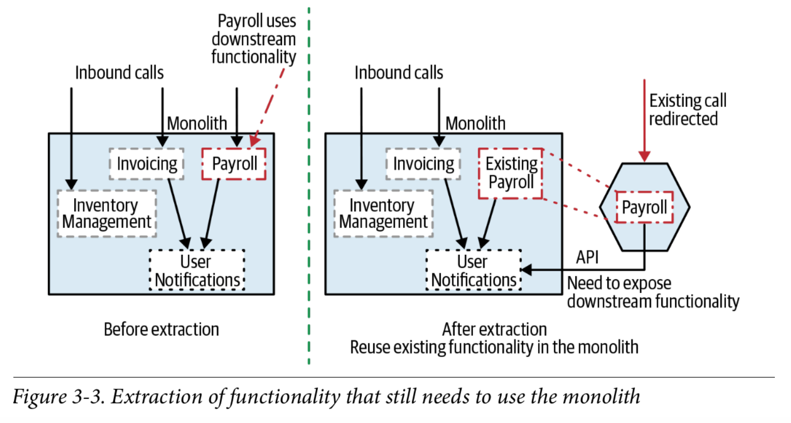
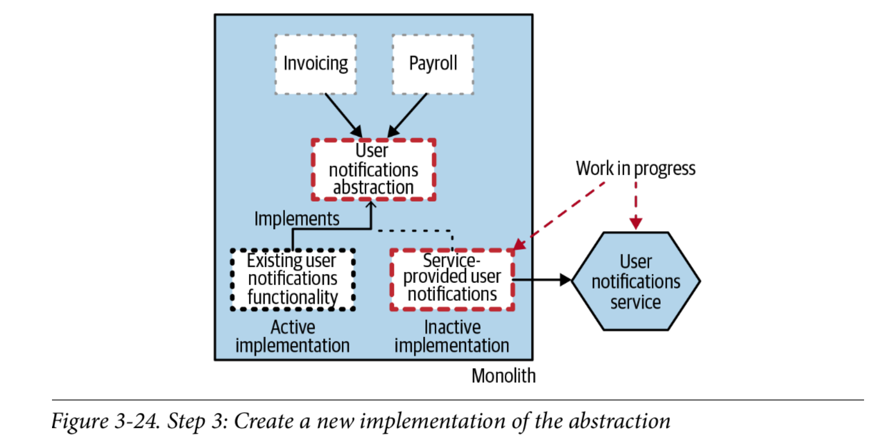

# Master Cloud Apps

## Aplicaciones nativas en la nube
 
### FASE 1

La fase 1 se compone de un monolito que se ejecuta directamente con el jar o con Maven.

Para levantar la fase 1 se ejecuta `mnv spring-boot:run` 

Se provee una colección de Postman para poder testear el API. Esta configurado por defecto para usar el puerto 8080

### FASE 2

Se extrae order-service del monolito y se crea un API Gateway con Spring Gateway para distribuir las peticiones entre el monolito y el nuevo servicio.

Para levantar la fase 2 se usa docker-compose.

* Primero hay que compilar con `mvn install` en el directorio `fase2`
* Levantar el entorno con `docker-compose up`

Se puede ejecutar la colección Postman para testear los servicios.

### FASE 3

Se extrae el notification-service del monolito y se crea un feature toggle usando variables de entorno.

Para levantar la fase 3 se usa docker-compose.

* Primero hay que compilar con `mvn install` en el directorio `fase3`
* Levantar el entorno con `docker-compose up`

### Enunciado
El objetivo de esta práctica consiste en simular un proceso de transformación de un
monolito a microservicios aplicando algunas de las técnicas vistas en clase.

#### Fase 1: Implementar un monolito básico

Con las siguientes funcionalidades:

* El monolito gestiona pedidos
* Un pedido se asocia a un cliente y a un único producto.
* Cada cliente tiene asociado un crédito (que va bajando en cada pedido)
* Cada producto tiene un stock (que va bajando en cada pedido)
* Cuando se hace un pedido, sólo se crea de forma satisfactoria si el cliente tiene
crédito y hay stock del pedido
* El monolito ofrece una API REST de los 3 servicios
* Existe un servicio de notificaciones por correo (que serán simuladas como escribir en
el log)
* Cada vez que se añade crédito a un usuario, se le envía una notificación.
* Se usará una base de datos H2 en memoria para simplificar la persistencia.
* Se escribirá una clase de test por entidad que verifique que las operaciones de la

API REST pueden realizarse.

#### Fase 2: Aplicar el patrón strangler fig para Pedidos

Se pide extraer el servicio de gestión de pedidos usando el patrón strangler fig:

* Se creará un microservicio que gestione los pedidos.
* Usará el monolito para procesar el stock de productos y el créditos del cliente.
* Hay que implementar un sistema básico de sagas con las siguientes características:
  * El servicio de pedidos no escribe el pedido en su base de datos hasta que no
ha verificado que hay crédito y hay stock. No es necesario que el pedido
tenga diferentes estados.
  * Si se reduce el crédito del cliente primero y luego no hay stock, se vuelve a
aumentar el crédito del cliente (a modo de transacción de compensación)

* Se usará un proxy para redirigir llamadas al monolito o al nuevo microservicio de
clientes (por ejemplo NGINX).
* Se verificará que los tests siguen funcionando.

#### Fase 3: Aplicar el patrón branch by abstraction para las notificaciones

El sistema de notificaciones será extraído a un nuevo microservicio:

* Se implementará un servicio de notificaciones.
* Se utilizará un sistema de feature toggle para que se pueda cambiar de la
implementación del monolito al microservicio.
* El sistema de feature toggle puede utilizar cualquier técnica (desde la más
rudimentaria a la más compleja)

